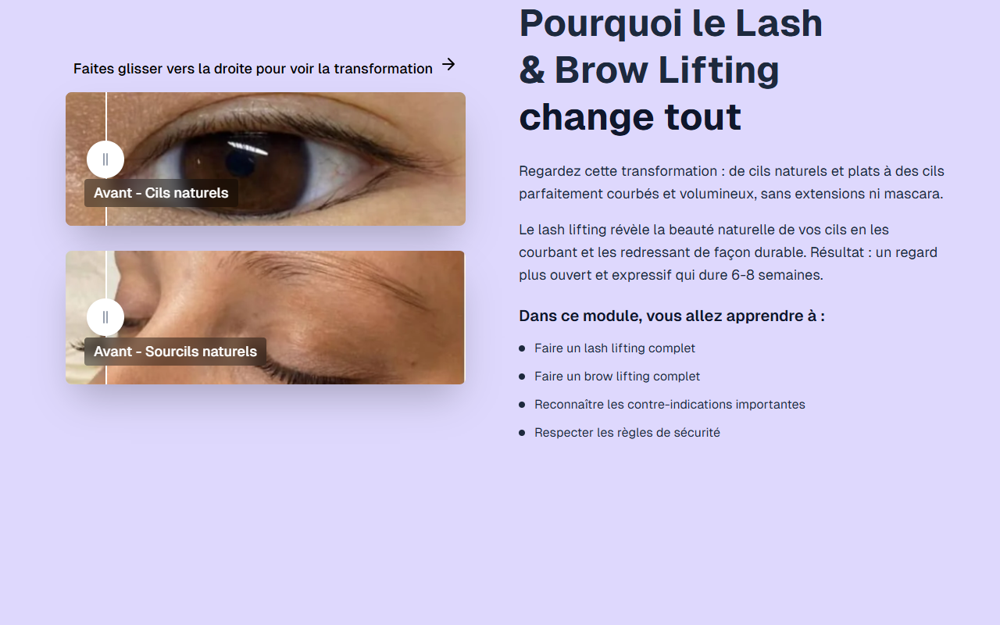

# Intro Slider — Combinaison LASH+BROW

**Course:** Combinaison LASH+BROW  
**Slide:** 1  
**Live URL:** https://v0-microbladingslider1.edtechiecorp.com  
**Stack:** Next.js · Tailwind CSS · TypeScript · GitHub Pages  

## What this slide does

Opening intro slider for the combined Lash + Brow course, presenting the course concept — mastering both lash lifting and brow lamination as a combined treatment offering. The slider introduces learners to the dual-skill nature of the course and explains why beauty professionals benefit from offering both services together. Sets the visual tone and learning expectations for the full module.

## Screenshot

## Usage

This slide is embedded as an iframe inside Coassemble at the live URL above. DNS is managed via Cloudflare (`edtechiecorp.com`). To update the slide, push to the `main` branch — GitHub Actions will rebuild and redeploy automatically.
